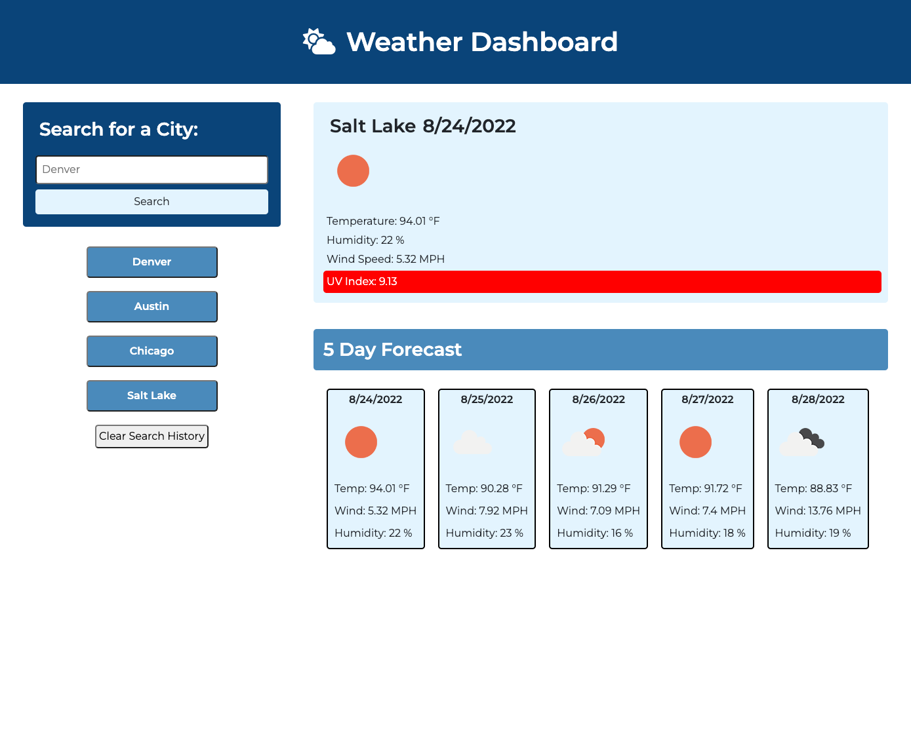

# Weather Dashboard

## Description
This application displays weather for the current date along with a 5 day forecast.

## Features
* When a city is searched, the user is presented with current and future conditions for that city.
* The city that was searched is then added to the search history.
* The current weather conditions for the searched city presents the city name, the date, an icon representing the weather conditions, the temperature, the humidity, the wind speed, and the UV index.
* The UV index presents a color that indicates weather the conditions are favorable, moderate, high, or severe.
* The future weather conditions for the city searched present the date, an icon representing the weather condition, the temperature, the wind speed, and the humidity.
* When the user clicks on a city in the search history, the current and future conditions for that city will be featured again.

## Mock-Up

The following image shows the web application's appearance and functionality:

## Links

* Link to Website: https://mich-hales.github.io/weather-dashboard/
* Link to GitHub Repository: https://github.com/mich-hales/weather-dashboard

